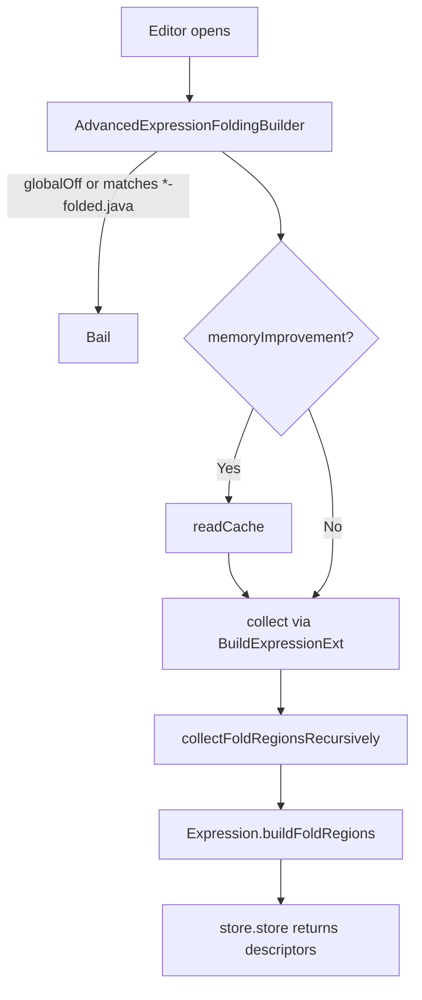
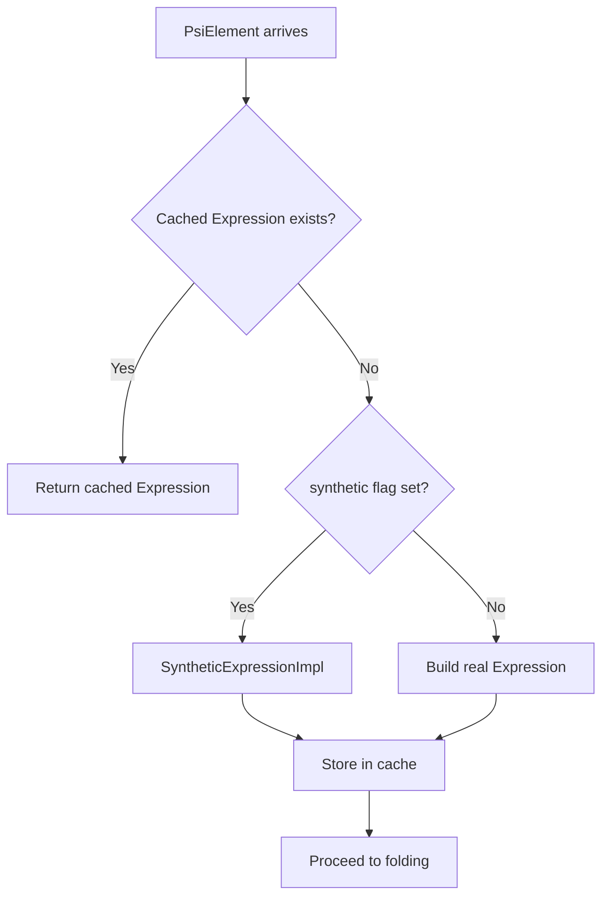
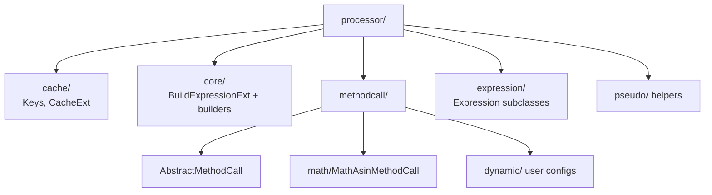

# Advanced Expression Folding – Contributor Field Guide

You wanted a single entry point. Here it is—no fluff, just what you need to stop wasting my time.

## 1. Runtime Flow in Plain English



* `AdvancedExpressionFoldingBuilder` wires everything together—if you break it, nothing folds.【F:src/com/intellij/advancedExpressionFolding/AdvancedExpressionFoldingBuilder.kt†L7-L80】
* `BuildExpressionExt` first tries to find a cached `Expression`; if none exists and `synthetic == true`, it fabricates a `SyntheticExpressionImpl` so downstream logic always has something to chew on.【F:src/com/intellij/advancedExpressionFolding/processor/core/BuildExpressionExt.kt†L15-L39】
* `collectFoldRegionsRecursively` deduplicates `Expression`s before asking each one to contribute folding descriptors.【F:src/com/intellij/advancedExpressionFolding/processor/core/BuildExpressionExt.kt†L41-L60】

## 2. Caching, Synthetic Expressions, and Why They Matter



* `Keys` stores per-element metadata: synthetic/non-synthetic `Expression`s, version stamps, and the full-descriptor cache.【F:src/com/intellij/advancedExpressionFolding/processor/cache/Keys.kt†L12-L62】
* `CacheExt.getExpression()` checks whether the PSI element changed. If not, it reuses the cached `Expression`; otherwise it rebuilds and updates the key (with a NULL_OBJECT sentinel for "no expression").【F:src/com/intellij/advancedExpressionFolding/processor/cache/CacheExt.kt†L10-L45】
* `CacheExt.invalidateExpired()` purges entries whose version key no longer matches the PSI modification stamp so stale `FoldDescriptor`s don't leak into later runs.【F:src/com/intellij/advancedExpressionFolding/processor/cache/CacheExt.kt†L47-L75】
* The **synthetic flag** tells the builder to fall back to a `SyntheticExpressionImpl` even when no feature-specific `Expression` exists. That way folding decisions still walk a stable tree, especially when `memoryImprovement` rehydrates descriptors.【F:src/com/intellij/advancedExpressionFolding/processor/expression/SyntheticExpressionImpl.kt†L5-L23】

## 3. Processor Layout (a map so you stop asking)



* `core` packages expose `BaseExpressionBuilder` variants for declarations, control-flow, literals, etc. Each builder registers via `tryBuildExpression` to cover specific PSI types. `BuildExpressionExt` walks these builders in order until one claims the element.【F:src/com/intellij/advancedExpressionFolding/processor/core/BaseExpressionBuilder.kt†L11-L27】【F:src/com/intellij/advancedExpressionFolding/processor/core/BuildExpressionExt.kt†L27-L60】
* `methodcall` contains one class per supported method family. The `MethodCallFactory` wires them into lookup tables keyed by qualified name, plus dynamic handlers coming from user configuration.【F:src/com/intellij/advancedExpressionFolding/processor/methodcall/MethodCallFactory.kt†L15-L125】

## 4. `AbstractMethodCall` in Slow Motion

* Implements multiple `I…State` interfaces by delegating to `AdvancedExpressionFoldingSettings.State()()`. That gives every handler live access to feature toggles without plumbing parameters.【F:src/com/intellij/advancedExpressionFolding/processor/methodcall/AbstractMethodCall.kt†L15-L22】
* `execute()` guards on qualifier requirements (`NeedsQualifier` mix-in), method names, and optional class-name filtering before delegating to argument-specific hooks.【F:src/com/intellij/advancedExpressionFolding/processor/methodcall/AbstractMethodCall.kt†L23-L53】
* Override `onNoArguments` / `onSingleArgument` / `onTwoArguments` / `onManyArguments` to build `Expression`s for the cases you actually support.【F:src/com/intellij/advancedExpressionFolding/processor/methodcall/AbstractMethodCall.kt†L55-L75】

## 5. Settings: `IState` and Friends

```mermaid
flowchart TD
    A[IState]
    A --> B[AdvancedExpressionFoldingSettings.State\n(persistent delegate)]
    B --> C[NewState\n(composed delegates)]
```

* `IState` is just an interface that aggregates the feature-specific state interfaces (`ILombokState`, `ILogFoldingState`, etc.).【F:src/com/intellij/advancedExpressionFolding/settings/IState.kt†L1-L14】
* `AdvancedExpressionFoldingSettings.State` is the persisted data class the IDE serializes (`editor.codeinsight.xml`). It also acts as a property delegate so you can access the singleton state via `AdvancedExpressionFoldingSettings.State()()`.【F:src/com/intellij/advancedExpressionFolding/settings/AdvancedExpressionFoldingSettings.kt†L16-L109】
* `NewState` shows how to compose the same interfaces through delegation instead of a single giant data class—useful when writing test doubles or future refactors.【F:src/com/intellij/advancedExpressionFolding/settings/NewState.kt†L1-L25】

## 6. Pseudo-Annotations (a glorified auto-complete)

* Live under `pseudo/`. `AbstractLoggingAnnotationCompletionContributor` and friends register completion contributors that only run when `pseudoAnnotations` is enabled in settings.【F:src/com/intellij/advancedExpressionFolding/pseudo/AbstractLoggingAnnotationCompletionContributor.kt†L139-L169】
* They check the toggle (via the same delegated state), inspect PSI context, and insert snippets like `@Main` or `@Loggable`. No folding involved—just editor assistance.

## 7. Putting It All Together

```mermaid
flowchart TD
    A[Editor] --> B[AdvancedExpressionFoldingBuilder]
    B --> C[BuildExpressionExt.getNonSyntheticExpression()]
    C --> D{Cache hit?}
    D -- Yes --> E[Use cached Expression tree]
    D -- No --> F[Builders & processors synthesize Expressions]
    E --> G[Expressions emit FoldingDescriptor[]]
    F --> G
    G --> H[IDEA renders folded regions + placeholders]
```

If any builder returns garbage, folding stops there. Keep the tree consistent.

## 8. Test Fixtures and Data Regeneration

* `testData/*.java` – canonical fixtures with `<fold text='{...}' expand='true'>…</fold>` markers (yeah, XML-ish) describing the expected folds.
* `testData/*-all.java` – raw source snapshots used when the auto-rewrite path updates fixtures.
* `folded/*-folded.java` – rendered previews produced from the same test failures; treat them as golden masters for reviewers.
* `examples/data/*.java` – marketing-facing examples that must mirror any folding change.

When a folding assertion fails inside `BaseTest`, the harness rewrites the `.java`, `.java-all`, and `.folded.java` files for you, then rethrows so you can `git diff` the result.【F:test/com/intellij/advancedExpressionFolding/folding/BaseTest.kt†L61-L116】 Set `dev-mode=1` if you want fixtures prefilled from `examples/data`.【F:test/com/intellij/advancedExpressionFolding/folding/BaseTest.kt†L102-L115】

**Heads-up:** IntelliJ sometimes throws `TooComplexException` (wrapped from the comparison contract bug) even when folding is correct. That’s test-only noise—rerun or split the scenario if it happens.【F:test/com/intellij/advancedExpressionFolding/folding/BaseTest.kt†L29-L60】

## 9. Integration Tests

* `test/com/intellij/advancedExpressionFolding/integration/IntegrationTest.kt` spins up a full IDE using IntelliJ Driver stubs.【F:test/com/intellij/advancedExpressionFolding/integration/IntegrationTest.kt†L44-L193】
* Opt-in by running `integration=1 ./gradlew test IntegrationTest` (skipped otherwise).【F:README.md†L172-L178】
* The stub API lives in `src/com/intellij/advancedExpressionFolding/integration/IntegrationTestApi.kt` and exposes toggles/count helpers.

## 10. Memory Cache (`memoryImprovement`)

* When enabled, `AdvancedExpressionFoldingBuilder` caches entire descriptor arrays per `PsiJavaFile`. On subsequent runs (non-quick passes), it pulls from `Keys.FULL_CACHE` after checking the PSI modification stamp.【F:src/com/intellij/advancedExpressionFolding/AdvancedExpressionFoldingBuilder.kt†L21-L57】
* Only test fixtures benefit: the cache path aborts for real project files because their modification stamps change constantly. Good for keeping the monster fixtures responsive.

## 11. Changing a Single Method Call Handler (Example: `MathAsinMethodCall`)

1. **Locate the handler** – `processor/methodcall/math/MathAsinMethodCall.kt`. It subclasses `AbstractMathMethodCall`; skim what it inherits before touching anything.
2. **Check registration** – `resources/META-INF/plugin.xml` lists every `methodCallFolding` extension. Make sure you understand the XML entry for `MathAsinMethodCall` before changing behavior.【F:resources/META-INF/plugin.xml†L133-L135】
3. **Update logic** – adjust the Kotlin class. Lean on the `onSingleArgument`/`onTwoArguments` hooks from `AbstractMethodCall` instead of inventing new plumbing.
4. **Run targeted folding tests** – find the matching fixture under `testData/` (search by `MathAsin`). Turn on only the relevant settings inside the test harness.
5. **Regenerate fixtures if needed** – if expectations change, let the failing test rewrite `testData/*.java`, `*-all.java`, and `folded/*`. Copy updates into `examples/data/` manually to keep docs honest.
6. **Keep dynamic configs in mind** – if behavior overlaps user-provided JSON/TOML definitions, update the docs or the loader in `processor/methodcall/dynamic` accordingly.
7. **Add/adjust integration coverage** – if UI behavior changes, extend `IntegrationTest` using the remote stub so reviewers can see the toggle working end-to-end.

